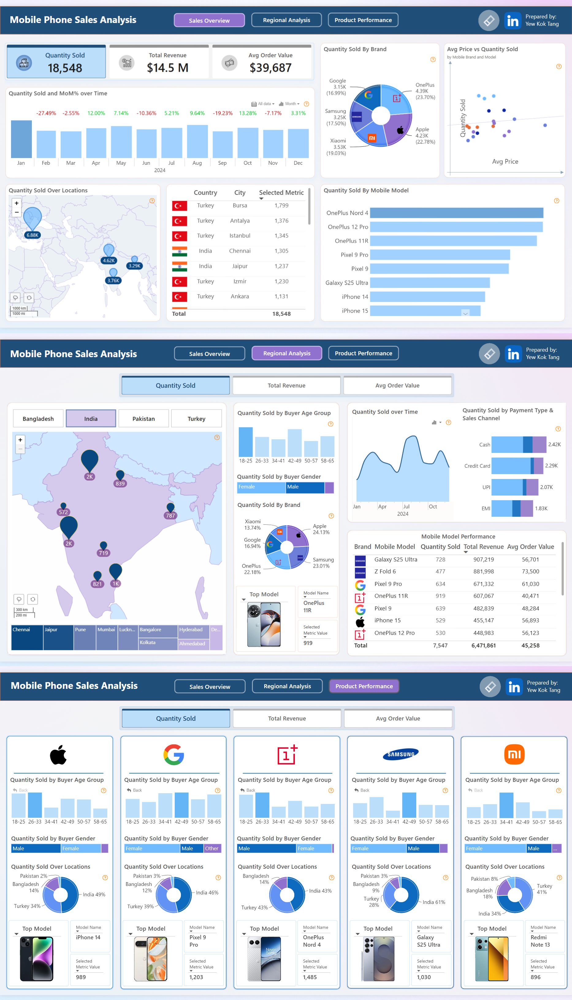

# 📊 Mobile Phone Sales Analysis - Power BI Dashboard

This repository contains my submission for the **DataDNA May 2025 Power BI Challenge**, where I designed an interactive dashboard to explore mobile phone sales across different countries, brands, and customer segments.

---

## 📚 Table of Contents

- [🔍 Project Overview](#-project-overview)
- [📁 Dashboard Structure](#-dashboard-structure)
- [🛠️ Tools & Skills Applied](#️-tools--skills-applied)
- [📸 Dashboard Report](#-dashboard-report)
- [📌 Key Insights](#-key-insights)
- [✅ Recommendations](#-recommendations)
- [📎 Files Included](#-files-included)
- [📬 Connect With Me](#-connect-with-me)

---

## 🔍 Project Overview

The goal of this project was to analyze mobile phone sales data and derive insights on:

- **Overall sales performance**
- **Regional trends and customer demographics**
- **Brand and product-level performance**

The final result is a **three-page Power BI dashboard** that enables users to explore trends by country, buyer profile, sales channel, and product.

---

## 📁 Dashboard Structure

### 📄 Page 1: Sales Overview
- KPIs: Quantity Sold, Total Revenue, Average Order Value
- Visuals: Monthly trend analysis, sales by location, top brands, avg price vs quantity sold, and model sales breakdown

### 🌍 Page 2: Regional Analysis
- Focus: Country-wise insights (Bangladesh, India, Pakistan, Turkey)
- Demographics: Gender, Age Group
- Visuals: Sales over time, payment types, sales channels, and top models

### 📱 Page 3: Product Performance
- Breakdown by Brand: Apple, Google, OnePlus, Samsung, Xiaomi
- Buyer Profile: Gender, Age Group, Top Locations
- Product Cards: Best-selling models with images and selected metric values

---

## 🛠️ Tools & Skills Applied

- **Power BI Desktop**
- Zoomcharts Drill Down PRO Visuals
- DAX for calculated metrics
- Custom visuals and dynamic filters
- Clean layout with consistent themes and drill-down capabilities

---

## 📸 Dashboard Report

📄 

---

## 📌 Key Insights

- **OnePlus** was the top-selling brand across all regions, while **Apple** generated the highest revenue.
- **Turkey** recorded the highest sales and revenue.
- **EMI** was the most commonly used payment method across all transactions.
- **September** saw a notable dip in total revenue, followed by a strong recovery in **October**.

---

## ✅ Recommendations

- **Expand OnePlus distribution and partnerships** across all regions to capitalize on its popularity and consistent sales volume.
- **Strengthen Apple’s premium positioning** by bundling services, offering trade-in programs, or targeting high-income segments to maintain and grow its high-revenue contribution.
- **Double down on marketing and logistics efforts in Turkey**, as it is the strongest-performing market. Consider launching region-specific promotions or early product releases there.
- **Promote EMI-friendly offers and visibility**, since EMI is the preferred payment method. Collaborate with more financial partners to expand eligibility and simplify the process.
- **Investigate the revenue dip in September**, which may signal seasonality, operational issues, or ineffective campaigns. Use learnings to prepare preventive measures for future periods.
- **Replicate successful strategies from October** that contributed to the revenue rebound—such as promotions, new product launches, or marketing pushes—and apply them in other low-performing months.

---

## 📎 Files Included

- `Excel file`: The dataset
- `README.md`: This file
- `PNG file`: The report pages

---

## 📬 Connect With Me

If you have feedback or suggestions, feel free to connect with me on [LinkedIn](https://www.linkedin.com/in/yewkoktang/). I'm always looking to grow as a data analyst and learn from the community!

---
